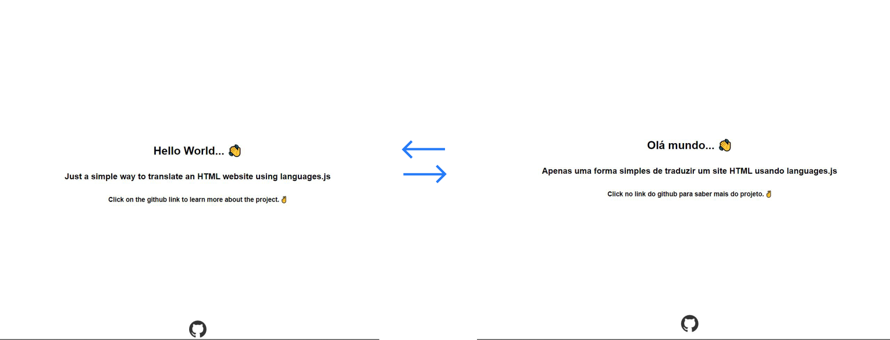
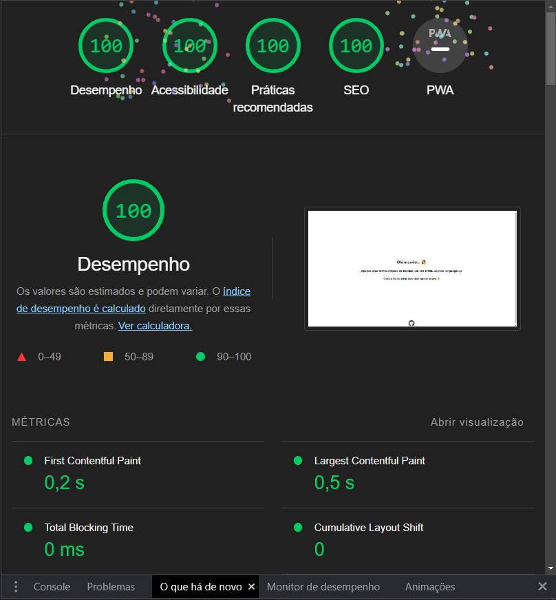

# Welcome to translate project

## About
#### This project aims to translate the content of a website using HTML and language.js dynamically. 
### The problem 😫
Currently, translating a website using these two tools is very simple, but it can be very verbose. because it is necessary to select all id's present in the project.

```html
<body>
    <h1 id="str"></h1>
    ...
</body>
```
```javascript 
window.onload = function() {
    Languages.init(['en_EN', 'fr_FR'], './languages/', () => {
        document.getElementById('str').innerHTML = 'hello'.t()
        ...
    });
}   
```
In the example above, it is possible to notice that for each content that needs to be translated, you need to select a different `id`, causing the code to have numerous `id`. In a real case where there are several pages the code will be gigantic. So i can develop a solution for this problem.

## The Solution 😎
Basically, I developed a base code to translate all translation variables, from all pages, according to the user's browser language.

## How to use
1. Import the language.js CDN and code translator from this project
``` html
<body>
    ...
    ...
    <script src="https://unpkg.com/languages-js@latest/languages.min.js"></script>
    <script src="translate.js"></script>
</body>
```
2. create the translation variables
```JSON
[{
  "WELCOME": "Hello World... 👋",
  "ABOUT": "Just a simple way to translate an HTML website using languages.js",
  "ACTION": "Click on the github link to learn more about the project. ✌️"
}]
```
3. HTML reference 
```html
<h1 class="translate" id="WELCOME" ></h1>
```
#### LOOK!👀
**To he code work, you need add the value `translate` on the class and add the `id` attribute. the value for the `id` attribute it has to be equal to the value of the translation variable present in the `JSON`**

## ❌❌What not to do?❌❌
1. the translation variable cannot have numbers 
```html
<h1 class="translate" id="WELCOME1" ></h1>
```
2.the translation variable cannot have dots `.`
```html
<h1 class="translate" id="WELCOME.TITLE" ></h1>
```

## How to run

There are several ways to do this.
1. You can download the VSCODE extension called `Live Server`
2. You can use python. For this you need open the command prompt and add this code `python -m http.server`. So you can be access through the port provided.
##### Or you can run it your way

## Future updates
Be possible to dynamically translate the title of the browser tab

## Relevant informations
### Default language
The code of a translator has a default language that can be changed for the you choice.

You can change the langue here.
```javascript
let defineLang = navigatorLang == 'pt-BR'? navigatorLang : 'en-US';
```
### Perfomance test


# Thank you very much for your attention 😎!
## Contributors

[Marcone Ribeiro](https://github.com/M4RC0N3)
